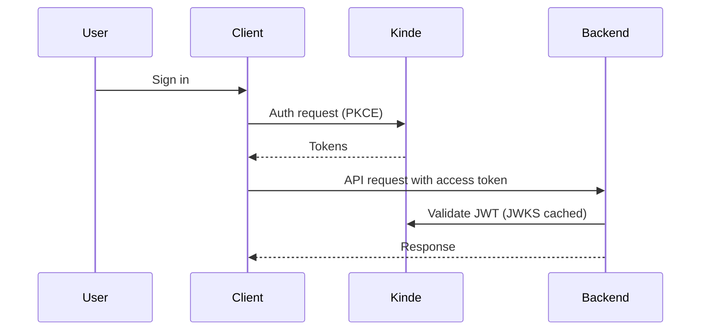

---
> [BACK TO INDEX](INDEX.md)
---


# Lumyn — Product Requirements Document (PRD)

Last updated: 2026-05-20

Repository: Lumyn

Overview: A next-generation AI neuroscience platform for cognitive optimization and mental performance.

---

**Contents**

- 1 Executive Summary
- 2 Product Overview
- 3 User Personas
- 4 Core Product Features
- 5 Frontend Web PRD (React + Next.js)
- 6 Mobile App PRD (React Native)
- 7 Backend PRD (FastAPI)
- 8 Database PRD (PostgreSQL)
- 9 Authentication PRD (Kinde)
- 10 AI & ML Product Requirements
- 11 API Product Requirements
- 12 Realtime EEG Architecture
- 13 DevOps & Deployment
- 14 Security Requirements
- 15 Monitoring & Analytics
- 16 Testing Strategy
- 17 Product Roadmap
- 18 Monetization Strategy
- 19 Cost Estimation
- 20 Final Recommendations

---

## 1. Executive Summary

- Product vision: Build Lumyn — a next-generation AI neuroscience platform for cognitive optimization and mental performance. It combines wearable EEG hardware, mobile and web apps, and cloud AI to deliver real-time brain metrics, personalized training, and clinically relevant insights.
- Mission: Democratize safe, actionable neuroscience and AI-driven cognitive enhancement for consumers, athletes, researchers, and clinicians.
- Business goals: 1) Launch MVP with basic EEG streaming, analytics, and neurofeedback within 6 months. 2) Reach 50k MAUs in 18 months. 3) Secure B2B enterprise deals with clinics and teams by Year 2. 4) Monetize via subscriptions, device sales, and enterprise licenses.
- Technical goals: Real-time low-latency EEG streaming, scalable ML inference, secure PII-compliant storage, multi-platform apps, modular backend with microservice-readiness, and reproducible ML pipelines.
- Target users: Students, professionals, athletes, meditators, researchers, clinicians, and biohackers.
- Market positioning: Premium health-tech + consumer cognitive enhancement with scientific rigor and enterprise extensibility.
- Unique selling points: Real-time EEG streaming + on-device pre-processing, AI personalization, multi-modal analytics (focus, stress, sleep), closed-loop neurofeedback, and developer-friendly APIs.
- Future scalability: Multi-tenant enterprise support, federated learning for privacy-preserving personalization, model versioning, edge inference on wearables, and global deployment with region-aware data residency.

---

## 2. Product Overview

What Lumyn is
- Lumyn is a full-stack neurotechnology ecosystem: a wearable EEG device (supporting 1–8 channels) + mobile app (React Native) + web dashboard (Next.js) + cloud backend (FastAPI) + AI/ML pipeline. Core flows: data ingestion → signal cleaning → feature extraction → ML inference → actionable insights and training delivery.

Wearable ecosystem
- Devices: lightweight headband or ear-EEG, BLE + optional USB for high-throughput. Devices perform ADC, basic filtering, and packetized data over BLE with timestamping and sequence numbers.
- Companion firmware: handles time sync, power management, OTA updates, and local artifact detection.

EEG data collection
- Sampling rates: 128–512 Hz selectable. Data format: interleaved channel samples, sequence ID, device timestamp, battery, and sensor status.
- Data collection modes: Live stream (WebSocket), buffered upload (batch via mobile), and scheduled sleep recording.

AI insights generation
- On ingestion, backend performs artifact removal (ICA/ASR heuristics), band-power computation (delta/theta/alpha/beta/gamma), connectivity metrics, and standard EEG features (PSD, ERSP). ML models then produce cognitive scores (focus, stress), stage detection (sleep), and personalized recommendations.

User interaction model
- Real-time: live dashboards, neurofeedback audio/visual cues, interventions.
- Async: session history, weekly trends, AI coaching suggestions.

System architecture summary (high-level)

```mermaid
graph LR
  Device-->MobileApp[Mobile App (BLE/Upload)]
  MobileApp-->API[FastAPI API / WebSockets]
  API-->Processing[Signal Processing & ML Inference]
  Processing-->DB[Postgres]
  Processing-->Storage[Supabase/R2]
  WebApp[Next.js Dashboard]-->API
  Admin-->API
```

---

## 3. User Personas

For each persona: goals, frustrations, use cases, device usage, AI expectations.

1) Students
- Goals: improve concentration and study efficiency, track sleep, and measure recovery.
- Frustrations: distractions, low motivation, unclear progress.
- Use cases: 20–60 minute study sessions with real-time focus feedback; sleep tracking during exams.
- Device usage: headband during study and sleep sessions; mobile-first.
- AI expectations: practical tips (timers, pomodoro integration), personalized study schedules.

2) Professionals
- Goals: boost productivity, reduce stress, improve meeting focus.
- Frustrations: cognitive fatigue, long workdays, unreliable biofeedback tools.
- Use cases: quick 10–20 minute focus sessions; integrations with calendar and task apps.
- Device usage: discrete ear-EEG or headband; rapid pairing and mobile notifications.
- AI expectations: actionable nudges, micro-break recommendations, productivity scoring.

3) Athletes
- Goals: optimize cognitive readiness and recovery, measure pre-competition focus.
- Frustrations: noisy environments, limited session time.
- Use cases: pre-game focus routines, post-training recovery monitoring.
- Device usage: rugged headband with secure fit, mobile + web dashboards for coaches.
- AI expectations: performance state detection, personalized warm-up protocols.

4) Meditation users
- Goals: deepen practice, measure progress in calmness and attention.
- Frustrations: subjective metrics, plateauing progress.
- Use cases: guided neurofeedback meditations with audio cues.
- Device usage: comfortable headband during sessions; home Wi‑Fi uploads for long sessions.
- AI expectations: adaptive meditation guidance and progress visualization.

5) Researchers
- Goals: collect high-quality EEG data, reproducible experiments.
- Frustrations: proprietary formats, limited raw-access, undocumented pipelines.
- Use cases: exportable raw data, annotation tools, API access to high-fidelity streams.
- Device usage: wired/USB mode for lab recordings, web UI for annotations.
- AI expectations: transparent models, metrics, downloadable pipelines.

6) Clinicians
- Goals: objective measures to augment assessments, patient monitoring.
- Frustrations: regulatory concerns, data privacy, integration with EHRs.
- Use cases: longitudinal patient tracking, protocols for ADHD, sleep disorders.
- Device usage: clinic-grade headband with validated channels; administrator dashboard.
- AI expectations: explainable metrics, clinically validated thresholds.

7) Biohackers
- Goals: maximize cognitive performance, granular telemetry.
- Frustrations: closed ecosystems, inability to tune models.
- Use cases: nightly sleep analytics, experimental training protocols, exporting datasets.
- Device usage: heavy mobile + web usage, frequent firmware updates.
- AI expectations: high-resolution metrics, parameter controls, model retraining hooks.

---

## 4. Core Product Features

For each feature we include: description, goals, UX expectations, backend requirements, APIs, mobile behavior, edge cases.

- Realtime EEG Monitoring
  - Description: Live streaming of band-limited EEG over WebSocket with 50–250 ms latency target.
  - Goals: low-latency visualization and neurofeedback.
  - UX: rolling time-series chart, channel selector, signal quality heatmap, reconnect UI.
  - Backend: WebSocket gateway, per-session state, sequence handling, time alignment.
  - APIs: WebSocket /ws/sessions/{session_id}/stream, REST session create/close.
  - Mobile: start/stop sessions, local buffering on disconnect, low-power mode.
  - Edge cases: packet loss, sensor disconnect, clock drift, high EMG artifacts.

- Brainwave Analytics
  - Description: PSD, band power, connectivity, ERSP.
  - Goals: scientifically valid metrics with configurable windows.
  - UX: band breakdown, power trends, topographic maps (if multichannel).
  - Backend: signal pipeline (filter, artifact removal, FFT), time-series DB storage.
  - APIs: /analytics/session/{id}/bands, /analytics/summary.
  - Mobile: lightweight visualization, background upload.
  - Edge cases: short sessions (<5s), missing channels.

- Cognitive Scoring
  - Description: composite score for focus, engagement, fatigue.
  - Goals: normalized, interpretable score (0–100) with confidence.
  - UX: score card with history and suggested interventions.
  - Backend: model inference + feature store; versioned scoring.
  - APIs: /ai/cognitive-score
  - Mobile: immediate feedback and short-term trends.
  - Edge cases: low-confidence predictions, invalid baseline.

- Stress Detection
  - Description: real-time stress likelihood with context-aware smoothing.
  - Goals: detect acute stress spikes and sustained stress epochs.
  - UX: notifications, breathing exercises, trend view.
  - Backend: classifier (temporal model), anomaly detection, event logging.
  - APIs: /ai/stress
  - Mobile: push alerts and quick interventions.
  - Edge cases: confounding motion artifacts, caffeine-induced signatures.

- Focus Tracking
  - Description: continuous attention metric used for neurofeedback and scoring.
  - Goals: enable closed-loop feedback for training sessions.
  - UX: session meter, live thresholds, audio cues.
  - Backend: rolling-window inference, stateful session scoring.
  - APIs: /ai/focus-stream
  - Mobile: haptic/audio feedback support.
  - Edge cases: multi-tasking contexts causing noisy labels.

- Sleep Analytics
  - Description: sleep-stage detection, sleep quality scoring, REM/light/deep breakdown.
  - Goals: nightly summary and trends.
  - UX: sleep timeline, sleep efficiency, recovery suggestions.
  - Backend: offline batch processing, model per-night inference.
  - APIs: /sleep/sessions/{id}
  - Mobile: scheduled upload, local fallback.
  - Edge cases: missing signal in parts of night, power loss.

- Neurofeedback Training
  - Description: guided sessions that provide real-time interactive feedback.
  - Goals: measurable improvement in attention or relaxation after a training program.
  - UX: guided flows, gamified progress, audio/visual feedback.
  - Backend: low-latency stream processing, session orchestration, reward scheduling.
  - APIs: /training/session
  - Mobile: low-latency BLE + WebSocket, offline session caching.
  - Edge cases: latency spikes that break closed-loop timing; device firmware mismatch.

- AI Recommendations
  - Description: personalized suggestions (timing, exercises, sleep hygiene).
  - Goals: increase retention and measurable performance improvements.
  - UX: weekly digest, contextual nudges, action buttons.
  - Backend: recommender engine combining collaborative filtering + content-based + rule-based safety layer.
  - APIs: /ai/recommendations
  - Mobile: action cards and calendar integration.
  - Edge cases: over-personalization, conflicting recommendations.

- Brain Training Games
  - Description: gamified neurofeedback tasks for attention and working memory.
  - Goals: engage users and produce measurable gains.
  - UX: real-time control of game elements via EEG metrics.
  - Backend: scoring, leaderboards, matchmaking (for community features).
  - APIs: /games/session, /games/leaderboard
  - Mobile: responsive game canvas with low-latency input.
  - Edge cases: unfair gameplay due to noisy signals.

- Session Recording
  - Description: store raw and processed session data with metadata and annotations.
  - Goals: research-grade exports and user review.
  - UX: share/export session, attach notes.
  - Backend: storage in object store (R2/Supabase) + metadata in Postgres.
  - APIs: /sessions/{id}/export
  - Mobile: upload controls, resume interrupted uploads.
  - Edge cases: large file sizes, partial uploads.

- Device Pairing
  - Description: secure BLE pairing flow with device fingerprints.
  - Goals: seamless first-time pairing and manifold device management.
  - UX: QR code, token exchange, guided steps.
  - Backend: pairing tokens, device registry.
  - APIs: /devices/pair
  - Mobile: background reconnection and firmware update flow.
  - Edge cases: multiple devices in range, pairing failure.

- Realtime Dashboard
  - Description: web dashboard showing live sessions, team views, and admin controls.
  - Goals: actionable monitoring and sharing.
  - UX: multi-panel layout, low-latency charts, modular widgets.
  - Backend: GraphQL/REST + WebSocket for live updates.
  - APIs: /dashboard/widgets
  - Mobile: condensed summary card for live sessions.
  - Edge cases: scaling dashboards with many concurrent viewers.

- Community Features
  - Description: social feeds, challenges, leaderboards, group training.
  - Goals: retention via social engagement.
  - UX: challenge flows, privacy controls.
  - Backend: social graph, rate-limited feeds, moderation tools.
  - APIs: /community/posts
  - Mobile: push notifications, in-app messaging.
  - Edge cases: harassment, misuse.

- Personalized Insights
  - Description: longitudinal, multi-factor insights combining EEG, sleep, and self-reported mood.
  - Goals: high-value, actionable recommendations.
  - UX: insight cards with confidence and rationale.
  - Backend: ensemble models, feature store, versioned insights.
  - APIs: /insights
  - Mobile: interactive insight drill-down.
  - Edge cases: contradictory signals.

- Mood Tracking
  - Description: optional self-reported mood tagging with time stamps and context.
  - Goals: correlate subjective state with EEG metrics.
  - UX: quick emoji-based inputs, journaling.
  - Backend: time-series linkage and correlation engine.
  - APIs: /mood
  - Mobile: widget and notification-driven journaling.
  - Edge cases: sparse labels.

- Productivity Scoring
  - Description: composite productivity metric combining focus time, interruptions, and sleep.
  - Goals: provide actionable productivity insights.
  - UX: daily score, trends, integration with calendars.
  - Backend: aggregation pipelines, normalization across contexts.
  - APIs: /productivity/score
  - Mobile: daily digest and suggested actions.
  - Edge cases: external factors dominating signal.

- Recovery Metrics
  - Description: measures of cognitive recovery after sleep and rest.
  - Goals: recommend recovery protocols.
  - UX: recovery timeline, readiness recommendation.
  - Backend: trend detection and thresholds.
  - APIs: /recovery
  - Mobile: recovery notifications and rest recommendations.
  - Edge cases: incomplete sleep data.

- Notifications
  - Description: contextual push notifications for events, sessions, and insights.
  - Goals: timely, non-intrusive nudges.
  - UX: configurable notification preferences.
  - Backend: push queue (APNs/FCM), notification templates, rate limiting.
  - APIs: /notifications
  - Mobile: deep links into relevant screens.
  - Edge cases: notification fatigue.

- Gamification
  - Description: badges, streaks, levels, leaderboards.
  - Goals: increase engagement.
  - UX: visible progress bar and reward flows.
  - Backend: achievements engine, event tracking.
  - APIs: /achievements
  - Mobile: animations and reward pop-ups.
  - Edge cases: gaming the system.

- Admin Panel
  - Description: tenant administration, device fleet management, data exports.
  - Goals: support enterprise and research customers.
  - UX: role-based views, audit logs.
  - Backend: admin APIs, data export, multi-tenant isolation.
  - APIs: /admin/*
  - Mobile: admin app optional.
  - Edge cases: accidental data exports.

---

## 5. Frontend Web PRD (React + Next.js)

Frontend architecture
- Component architecture: atomic + composite approach (atoms, molecules, organisms). Use shadcn/ui as base primitives and Tailwind utility classes + design tokens.
- Folder structure: see folder tree below.
- Routing: Next.js App Router (recommended) with parallel routes and layout nesting for dashboard and auth. Protect routes using server components for SSR auth checks when possible.
- State management: React Query (TanStack) for server state; Zustand for ephemeral client state (UI toggles, websocket connection state); Redux Toolkit reserved for complex cross-cutting state in enterprise features.
- API layer: typed API client using OpenAPI-generated TypeScript types (from FastAPI OpenAPI) and react-query hooks wrapping fetch/axios.
- Reusable component system: design tokens + shadcn primitives, central icons, chart wrappers, skeletons, and loading components.
- Accessibility: keyboard navigability, WCAG 2.2 AA, semantic HTML, color contrast, ARIA for dynamic content.
- Responsive strategy: mobile-first breakpoints, fluid grids, collapsible sidebars for small screens.

Frontend folder structure (recommended)

```text
src/
  app/                    # Next.js App Router pages and layouts
  components/
    ui/                   # design primitives (buttons, inputs, modals)
    charts/               # chart wrappers (Recharts wrappers)
    eeg/                  # EEG visualizations
    dashboard/            # dashboard specific components
  hooks/                  # reusable hooks (useWebsocket, useSession)
  providers/              # context providers (Auth, Theme, Websocket)
  services/               # API clients and utils
  stores/                 # Zustand stores
  styles/                 # tailwind and design tokens
  lib/                    # small utilities
  ai/                     # frontend AI helpers (types, preview models)
  animations/             # Framer Motion variants
```

Pages & Dashboard Screens (spec highlights)

- Landing Page
  - Layout: hero, features, social proof, pricing CTA.
  - Components: animated hero, device showcase with simulated EEG waveform.
  - Interactions: CTA to signup and download app.
  - API deps: marketing-only; SSR for SEO.

- Login / Signup
  - Layout: unified auth flow with Kinde login and social sign-in.
  - Components: magic-link, SSO buttons.
  - Interactions: progressive disclosure for personal vs enterprise accounts.

- Dashboard
  - Layout: left nav, main canvas with modular widgets, topbar with user quick actions.
  - Components: session start, live viewer card, recent sessions, insights feed.
  - Interactions: drag-and-drop widgets, widget settings modal.
  - Loading/empty states: skeletons and CTA to start a session.

- EEG Analytics
  - Layout: session timeline, multi-channel viewer, band-power graphs, topomap.
  - Components: channel selector, artifact overlays, export button.
  - Interactions: zoom/pan, channel mute, annotation tools.

- AI Insights
  - Layout: insight cards prioritized by impact and confidence.
  - Components: rationale modal, actionable buttons.

- Sleep Analytics
  - Layout: hypnogram, stage breakdown, efficiency score.
  - Components: trend calendar, export PDF.

- Training Sessions
  - Layout: session launcher, program list, progress.
  - Components: adaptive trainer, in-session live feedback overlay.

- Device Center
  - Layout: device list, firmware status, battery, pairing.
  - Components: pair dialog with QR code, firmware OTA modal.

- Session History
  - Layout: list + timeline + filters.

- Community
  - Layout: feed, challenges, groups.

- Pricing
  - Layout: tier cards, enterprise contact form.

- Settings
  - Layout: profile, account, notifications, integrations.

- Admin Dashboard
  - Layout: tenant overview, export, audit logs.

UI/UX Design System
- Typography: geometric sans for headings (Inter/Space Grotesk), variable font weights. Token sizes: h1 40/48, h2 28/36, body 16/20.
- Spacing: 4px base grid; scale: 4,8,12,16,24,32,48,64.
- Color palette:
  - primary: "#0B2948"
  - secondary: "#35C66B"
  - background: "#07111F"
  - surface: "#0F172A"
  - accent: "#6EF0A5"
  - muted: "#64748B"
  - Palette reference: https://coolors.co/0b2948-35c66b-07111f-0f172a-6ef0a5-64748b

- Design tokens:
  - colors: follow palette above (use semantic tokens: `color-bg`, `color-surface`, `color-primary`, `color-secondary`, `color-accent`, `color-muted`).
  - border-radius:
    - sm: "12px"
    - md: "18px"
    - lg: "24px"
    - xl: "32px"
  - shadows, motion durations: keep existing scale but tie to tokens.
- Dark mode: inverted surfaces, maintain glow intensity but reduce saturation.
- Glassmorphism & neural glow: use subtle backdrop-filter blur, layered glows for emphasis, but keep contrast for accessibility.
- Animations: Framer Motion spring-based patterns, motion reduced setting respects OS preference.

Frontend State Management (comparison)
- React Query: Best for server state, caching, mutation flows, and offline sync.
- Zustand: Lightweight client state for websocket connection, small UI flags, and ephemeral session state.
- Redux Toolkit: Useful for complex enterprise state with normalized entities and sophisticated middleware (audit logs). Use only when necessary.
Recommendation: React Query + Zustand primary stack, add Redux only if enterprise features need it.

Frontend Performance Strategy
- Code splitting: dynamic imports for heavy charting libs and admin pages.
- Lazy loading: load non-critical widgets after LCP.
- WebSocket optimization: delta updates (diffs), binary protobuf payloads for waveform frames.
- Chart rendering: virtualized canvas for large time-series, downsample with LTTB for visualization.
- Animation perf: use transform/opacity only, avoid layout thrashing, prefer requestAnimationFrame loops.
- SSR vs CSR: SSR for landing and SEO pages; CSR/SSR-hydrated for dashboard with streaming via WebSocket.
- Caching: React Query cache with stale-while-revalidate patterns and ETags for heavy endpoints.

---

## 6. Mobile App PRD (React Native)

Mobile Features
- Realtime EEG monitoring via BLE or mobile acting as gateway (WebSocket tunnel).
- Wearable connection: pairing, battery, firmware updates.
- Bluetooth sync: robust reconnection and background mode per OS limits.
- Sleep tracking: scheduled high-throughput capture with local buffering.
- Push notifications: APNs/FCM for sessions and insights.
- AI insights: lightweight summaries and deep-dive pages.
- Offline mode: local caching of sessions and upload retries.
- Sync engine: resumable chunked uploads to object store.

Mobile Screens (high-level)

- Splash Screen
  - Layout: brand animation, quick device status check.

- Onboarding
  - Layout: device setup, consent, baseline calibration.

- Authentication
  - Layout: Kinde login + biometric unlock.

- Home Dashboard
  - Layout: quick-start session, last session summary, suggested actions.

- Live EEG
  - Layout: full-screen waveform, meter overlays, feedback controls.
  - Gestures: pinch zoom, swipe to change channels.
  - Offline: show buffered data indicator.

- AI Insights
  - Layout: cards, share, act buttons.

- Sleep Tracking
  - Layout: hypnogram, sleep score cards.

- Focus Tracking
  - Layout: session controls, real-time focus meter.

- Device Pairing
  - Layout: BLE scan, QR pairing, step-by-step helper.

- Community
  - Layout: feed, challenges.

- Profile / Settings

Mobile Architecture
- Expo managed workflow with EAS Build for native modules (BLE, background tasks).
- Navigation: React Navigation with stack + bottom-tabs. Deep links enabled.
- State management: Zustand + React Query.
- BLE integration: react-native-ble-plx or noble fork inside Expo prebuild (NativeModules for performance-critical streams).
- WebSocket strategy: secure channel from mobile to API, use native socket fallback for streaming.
- Local caching: SQLite or MMKV for fast time-series buffering.
- Sync: chunked uploads via resumable endpoints (signed URLs to R2/Supabase).

Mobile Folder Structure (recommended)

```text
src/
  screens/
  components/
  services/
    ble/
    websocket/
    sync/
  stores/
  hooks/
  assets/
  navigation/
  utils/
```

---

## 7. Backend PRD (FastAPI)

API architecture
- FastAPI application with modular routers. Use Pydantic v2 models for validation and type-safety. Expose OpenAPI for frontend clients.
- Services organized by domain: auth, eeg, analytics, ai, sleep, training, devices, community, admin.

Websocket architecture
- Use Uvicorn + Gunicorn workers with an ASGI server capable of handling many persistent connections (uvicorn with --ws). For horizontal scaling, use a WebSocket gateway (Redis pub/sub) to broadcast events between instances.

Realtime EEG streaming
- WebSocket gateway endpoint /ws/sessions/{session_id} supports binary frames. Mobile acts as gateway or direct device connection from browser (Web Bluetooth) where supported.
- Use protobuf or MessagePack for compact payloads (timestamp, sequence, channel values).

Background jobs
- Use Celery (or Dramatiq) with Redis broker for: nightly sleep processing, model training triggers, email notifications, and long-running exports.

AI inference
- Inference served via internal /ai/predict endpoints behind an auth layer. For heavy models, use a dedicated inference service (FastAPI microservice) that loads PyTorch/TensorFlow models and exposes gRPC or REST.

Authentication flow
- Kinde integration for OIDC; backend validates JWTs using Kinde public keys and enforces RBAC.

Admin architecture
- Admin APIs prefixed with /admin. Use role guards and tenant scopes. Provide export, audit, and user-management functions.

Microservice readiness
- Codebase modularity: service layer, repository layer, API layer. Dockerized services and clear kubernetes-friendly entry points.

Backend folder structure

```text
app/
  main.py
  api/
    v1/
      auth.py
      eeg.py
      ai.py
      sleep.py
      training.py
      devices.py
      community.py
      admin.py
  services/
    auth_service.py
    eeg_service.py
    analytics_service.py
    ai_service.py
  core/
    config.py
    db.py
    websocket.py
  models/
  schemas/
  repositories/
  tasks/  # celery tasks
  tests/
```

Websocket gateway architecture
- Each instance subscribes to Redis channel for session updates. When a device uploads frames to instance A, it publishes frames to Redis channel session:{id} so all viewers (instances) receive them.

---

## Backend Modules (specs)

- Auth service
  - Responsibilities: user identity, token verification, RBAC, integration with Kinde.
  - APIs: /auth/signup, /auth/login (redirects), /auth/validate, /auth/refresh
  - Websocket: none.
  - DB deps: users, roles, sessions.
  - Scalability: stateless; key validation via JWKS.

- EEG service
  - Responsibilities: session orchestration, raw ingestion, preprocessing.
  - APIs: /sessions, /sessions/{id}/start, /sessions/{id}/stop
  - Websocket: /ws/sessions/{id}
  - DB deps: eeg_sessions, device_pairings, brainwave_metrics.
  - Scalability: partition sessions by shard key (tenant or region).

- Analytics service
  - Responsibilities: band computations, PSD, connectivity.
  - APIs: /analytics/*
  - Websocket: optional for derived metrics stream.
  - DB deps: brainwave_metrics, aggregates.
  - Scalability: batch processing workers, time-series optimized storage.

- AI service
  - Responsibilities: model inference, model lifecycle, versioning.
  - APIs: /ai/predict, /ai/recommendations, /ai/models
  - Websocket: realtime predictions stream.
  - DB deps: ai_predictions, model_registry.
  - Scalability: GPU instances for heavy inference; autoscale with queue depth.

- Sleep service
  - Responsibilities: nightly analysis, staging detection.
  - APIs: /sleep/sessions
  - DB deps: sleep_sessions.
  - Scalability: batch workers, temporal partitioning.

- Notification service
  - Responsibilities: push queue, templating, scheduling.
  - APIs: /notifications
  - DB deps: notifications, device_tokens.
  - Scalability: send worker pool with rate limits.

- Community service
  - Responsibilities: posts, challenges, moderation.
  - APIs: /community/*
  - DB deps: posts, comments, likes.
  - Scalability: feed generation queue and caching.

- Admin service
  - Responsibilities: exports, tenant management, audit logs.
  - APIs: /admin/*
  - DB deps: tenants, audit_logs.
  - Scalability: admin operations are I/O heavy; schedule via workers.

---

## 8. Database PRD (PostgreSQL)

ERD explanation
- Central entities: users, organizations (tenants), devices, sessions, brainwave_metrics, ai_predictions, sleep_sessions, training_sessions, device_pairings, subscriptions, notifications, community, achievements.

Relational design highlights
- Use integer primary keys (or UUIDs) with indexes for lookups. Time-series data stored in dedicated tables partitioned by date or session id. Consider TimescaleDB extension for hypertables if heavy timeseries queries are expected.

Indexing & partitioning
- Indexes on: (user_id), (session_id), (device_id), (created_at). For time-series tables, partition by month or use TimescaleDB compression.

Example tables

- users
  - id: uuid PK
  - email: varchar unique
  - name: varchar
  - role: enum
  - created_at: timestamptz

- devices
  - id: uuid PK
  - user_id: uuid FK
  - device_type: varchar
  - serial: varchar unique
  - last_seen: timestamptz
  - firmware_version: varchar
  - metadata: jsonb

- eeg_sessions
  - id: uuid PK
  - user_id: uuid FK
  - device_id: uuid FK
  - started_at: timestamptz
  - ended_at: timestamptz
  - sampling_rate: int
  - channels: int
  - meta: jsonb
  - status: enum
  - Indexes: (user_id, started_at)

- brainwave_metrics (time-series partitioned)
  - id: bigserial PK
  - session_id: uuid FK
  - ts: timestamptz
  - channel_values: float8[] or jsonb compressed
  - band_power: jsonb (delta/theta/alpha/beta/gamma)
  - features: jsonb
  - Indexes: (session_id, ts)

- ai_predictions
  - id: uuid PK
  - session_id: uuid FK
  - model_version: varchar
  - prediction_type: varchar
  - value: jsonb
  - confidence: float
  - created_at: timestamptz

- sleep_sessions
  - id: uuid PK
  - user_id: uuid
  - start_ts, end_ts
  - stage_summary: jsonb
  - score: float

- device_pairings
  - id: uuid
  - device_id, user_id
  - paired_at

- subscriptions
  - id: uuid
  - user_id
  - tier
  - active_until

- notifications
  - id: uuid
  - user_id
  - type
  - payload jsonb
  - status

- social/community tables

- achievements
  - id, user_id, badge, created_at

Constraints & data integrity
- Use FK constraints for critical relations; soft deletes where required; use JSONB for flexible metrics but maintain canonical columns for frequently queried metrics.

Migration strategy
- Use Alembic for schema migrations; maintain migration history; CI pipeline runs migrations against staging prior to production deploy.

Scaling notes
- Use read replicas for analytical workloads; offload heavy time-series reads to analytical DB or TimescaleDB; consider S3/R2 for raw waveform blobs and keep metadata in Postgres.

---

## 9. Authentication PRD (KINDE)

Integration
- Use Kinde as OIDC provider. Frontend uses Kinde SDK to handle sign-in and token refresh. Backend validates JWTs (RS256) using Kinde JWKS.

JWT lifecycle
- Access token short-lived (e.g., 15m); refresh tokens rotated and stored client-side (secure httpOnly cookie for web or secure storage for mobile). Backend validates token expiry and audience.

RBAC
- Role model: user, admin, researcher, clinician, enterprise_admin. Enforce roles via decorators and scope claims in JWT.

OAuth flows
- Use PKCE for mobile and web SPA flows; server-side flows for admin/enterprise with confidential client.

Refresh tokens
- Use refresh tokens with rotation and revoke lists; implement token blacklisting on logout.

Middleware
- Implement FastAPI middleware to validate tokens on each request, attach `current_user` to request state, and verify tenant scope.

Session management
- Stateless sessions for scale; maintain session audit logs and optional server-side session revocation table.

Frontend auth flow
- Login via Kinde; on success, store tokens in secure storage; use silent refresh or background refresh.

Mobile auth flow
- Use system browser flow (recommended) with PKCE; store tokens in secure storage (Keychain/Keystore).

Backend verification
- Validate signature, exp, nbf, audience, and scopes. Use caching for JWKS keys.

Token lifecycle diagram



Role hierarchy
- enterprise_admin > clinician > researcher > user

---

## 10. AI & ML Product Requirements

Model objectives
- Focus prediction, stress detection, cognitive scoring, sleep staging, recommendation engine.

Data collection
- Collect raw EEG, preprocessed features, device telemetry, user labels (mood, task), and metadata. Enforce consent flows and provide data export.

Training pipeline
- Stages: data ingestion → cleaning (artifact removal) → feature extraction → train/validate/test → model packaging.
- Tools: PyTorch/TensorFlow, Scikit-learn, MNE-Python for EEG-specific transforms, MLFlow for experiment tracking.

Feature engineering
- Time-domain and frequency-domain features, connectivity (PLV, coherence), time-frequency transforms (wavelets), event-related potentials.

Inference APIs
- /ai/predict for batch and realtime endpoints. Realtime inference must support low-latency models (<200ms per window).

Realtime inference
- Use lightweight models for on-device or on-edge inference (tiny-CNN, quantized models). For server-side, serve via dedicated inference service with GPU or CPU microservices.

Model deployment & versioning
- Model registry with semantic versioning, manifest with architecture, inputs, outputs, and evaluation metrics.

Evaluation metrics
- For classification: accuracy, precision/recall, ROC-AUC. For regression/scores: RMSE, MAE. For sleep staging: Cohen's kappa, F1 per stage.

ML lifecycle
- CI for training pipelines, model validation gates, canary deployment for models with monitoring for drift.

Privacy & ethics
- De-identify data, opt-in research consents, data retention policies, model explainability (SHAP/LIME), guardrails for high-impact recommendations.

Monitoring
- Monitor model performance with data drift detection, prediction distributions, and feedback loop for retraining.

---

## 11. API Product Requirements

Principles
- RESTful endpoints for CRUD and admin; WebSocket for streams; pagination, filtering, validation via Pydantic.

Rate limiting
- Per-IP and per-user rate limits with Redis-backed counters. Special higher quotas for enterprise.

Example REST endpoints

- Auth
  - POST /auth/refresh
  - GET /auth/me

- Sessions
  - POST /sessions (create/start)
  - GET /sessions/{id}
  - POST /sessions/{id}/stop
  - GET /sessions?user_id=&from=&to=

- EEG
  - WebSocket /ws/sessions/{id}/stream
  - GET /analytics/session/{id}/bands

- AI Predictions
  - POST /ai/predict
  - GET /ai/models

- Sleep
  - GET /sleep/sessions/{id}

- Devices
  - POST /devices/pair
  - GET /devices/{id}

- Community
  - POST /community/posts

WebSocket events
- Event types: frame, metrics, annotation, ai_prediction, heartbeat, session_end.

Response schemas
- Standard envelope: { status, data, errors, meta }

Pagination & filtering
- Cursor-based pagination for large feeds; filter by date ranges, models, confidence.

Validation
- Use Pydantic v2 strict models; return structured validation errors.

Rate limiting & throttling
- 429 with Retry-After; quota endpoint /quota to introspect usage.

---

## 12. Realtime EEG Architecture

EEG stream lifecycle
- Device samples → device packetization (seq, ts) → mobile gateway → secure WebSocket to backend → preprocessing → inference → broadcast to viewers.

WebSocket events
- frame: binary payload with header (session, seq, ts)
- metrics: JSON with band powers
- ai_prediction: JSON with prediction and confidence
- heartbeat: keepalive
- reconnect: client initiated

Signal processing
- Preprocessing: bandpass (0.5–40Hz), notch filter (50/60Hz), artifact removal (ICA/ASR heuristics), baseline correction.
- FFT: windowed FFT (Hann) with overlap; compute band powers.

Artifact removal
- Use adaptive thresholding, channel-level SNR checks, and optional ICA for multi-channel.

Chart streaming
- Backend computes downsampled frames for visualization; frontend renders via canvas; use binary diffs to reduce payload.

Reconnect strategy
- Exponential backoff with jitter, resume by sequence ID, request missing frames via /sessions/{id}/frames?from_seq=x

Channel structure
- Frame payload includes channels in consistent order; include channel labels in session metadata.

---

## 13. DevOps & Deployment

Docker architecture
- Each service containerized: api, ai-inference, worker, websocket-proxy, nginx/traefik.

CI/CD
- GitHub Actions: lint, unit tests, build images, push to registry, run migrations on staging, deploy via Railway/Render or K8s.

Environment management
- Use env files with secrets from GitHub Secrets or Vault. Use per-environment configs.

Staging vs production
- Staging mirrors production with smaller instance sizes and test data. Use feature flags.

Free deployment comparison
- Railway: fast prototype, limited concurrency.
- Render: straightforward Docker deploys, managed Postgres.
- Fly.io: edge deployment, good for low-latency websocket endpoints.
- Koyeb: serverless containers.
- Vercel: frontend SSR hosting (Next.js), but not websockets.
- Supabase: great for auth/storage but less flexible for custom inference.

Recommendation
- Host web frontend on Vercel; backend on Fly.io or Render (use Fly.io for websocket low-latency edge), Postgres on managed provider (Supabase or Railway), object storage on Cloudflare R2.

---

## 14. Security Requirements

- OWASP best practices: input validation, auth, CSRF on forms, strict CORS, secure cookies.
- JWT security: RS256, short lifetimes, rotate refresh tokens.
- API protection: rate limiting, request signing for device uploads.
- WebSocket security: TLS, origin checks, token auth on connect.
- Encryption: at-rest encryption (db + object store), in-transit TLS.
- Secrets management: GitHub Secrets + HashiCorp Vault for production.
- GDPR/privacy: data deletion endpoints, consent flows, data export, region-aware storage.

---

## 15. Monitoring & Analytics

- Logging: structured JSON logs, log levels per environment.
- Observability: Prometheus + Grafana for metrics, BetterStack or Sentry for error tracking, OpenTelemetry for traces.
- Crash reporting: Sentry for frontend and backend.
- API monitoring: synthetic checks, uptime checks.
- WebSocket monitoring: connection counts, message rates, reconnection rates.
- ML monitoring: input distribution, prediction drift, model latency.

Tool comparison
- Grafana + Prometheus: metrics and dashboarding (recommended).
- Sentry: error/crash tracking (recommended).
- BetterStack: integrated logs + monitoring alternative.

---

## 16. Testing Strategy

- Frontend: Jest + React Testing Library, Cypress for E2E.
- Mobile: Detox for e2e, Jest for unit tests, Expo E2E tools.
- Backend: Pytest with fixtures, integration tests against test Postgres, contract tests for APIs.
- Websocket testing: simulated clients and load tests with Locust or k6.
- ML testing: unit tests for preprocessing, model integration tests with synthetic data, continuous evaluation harness.

CI: run unit tests, lint, and a lightweight integration test suite on PRs; nightly full integration tests.

---

## 17. Product Roadmap

- MVP (0–6 months)
  - Live EEG streaming (basic 1–2 channel)
  - Session recording and exports
  - Basic analytics (band powers)
  - Cognitive scoring prototype
  - Mobile app: pairing and live session
  - Web dashboard: live viewer, session history

- V1 (6–12 months)
  - Multi-channel support
  - Sleep analytics
  - Neurofeedback training flows
  - AI recommendations
  - Billing and subscriptions

- V2 (12–24 months)
  - Clinician/researcher features
  - Enterprise tenanting
  - Model personalization and federated learning

- Enterprise roadmap (24+ months)
  - EHR integrations
  - On-prem deployments
  - Regulatory certification (HIPAA-compliant offering)

Engineering milestones
- Month 1–2: hardware pairing and basic streaming
- Month 3–4: backend ingestion and analytics
- Month 5–6: ML prototype and MVP launch

---

## 18. Monetization Strategy

- Subscription tiers
  - Free: limited sessions, basic analytics
  - Pro: full analytics, training programs, priority support
  - Team/Enterprise: multi-seat, admin, integrations
- Device sales: subsidized hardware with subscription bundle.
- Premium AI analytics: advanced models, clinical reports for clinicians.
- Enterprise dashboards: multi-tenant analytics and SSO.

---

## 19. Cost Estimation

- Free MVP (prototype)
  - Backend: small VM (Render/Fly) $50–200/mo
  - Postgres: managed $20–50/mo
  - Storage: R2 minimal $10/mo
  - Misc: domain, CI ~ $50/mo

- Startup scale (50k MAU)
  - Backend + inference: $2k–10k/mo (depending on GPU usage)
  - DB + replicas: $500–2k/mo
  - Storage: $200–1k/mo

- Enterprise scale
  - Ready for $10k–50k+/mo including dedicated inference, compliance, and support.

---

## 20. Final Recommendations

- Recommended architecture: Next.js frontend on Vercel, FastAPI backend on Fly.io (edge for websockets), Postgres managed (Supabase/RDS), Redis for broker and pub/sub, Cloudflare R2 for raw waveform storage, Kinde for auth, CI with GitHub Actions.
- Scalability path: separate inference service, use TimescaleDB for heavy time-series, add GPU-backed inference pool, and introduce multi-region data residency.
- Engineering priorities: 1) Reliable low-latency streaming and pairing; 2) reproducible signal pipeline; 3) simple, compelling mobile + web UX for MVP; 4) instrumentation & monitoring from day one.
- Fastest MVP approach: focus on a single wearable type (1–2 channels), mobile gateway, server-side streaming and analytics, single-tenant launch with Pro subscriptions.

---

Appendices

- Folder trees, API examples, mermaid diagrams, and DB schema snippets included inline above. If you want expanded OpenAPI examples, Alembic migration templates, or seed data, I can produce them next.

File created: [Lumyn-PRD.md](Lumyn-PRD.md#L1)
