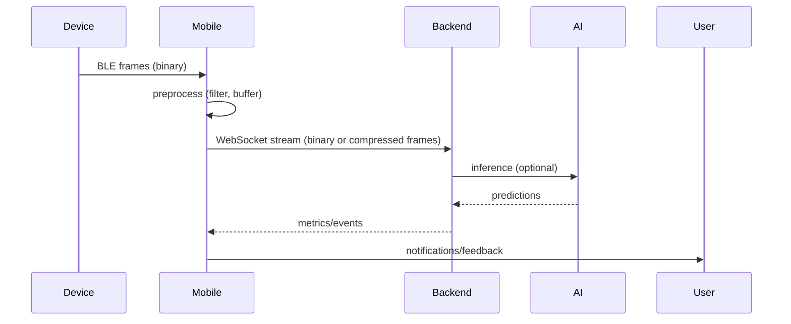

---
> [BACK TO INDEX](INDEX.md)
---
# NeuroFit Mobile — Technical Requirements Document (TRD)

Last updated: 2026-05-20

File: NeuroFit-ReactNative-TRD.md

Purpose: enterprise-grade technical blueprint for the NeuroFit Mobile Application (React Native + Expo). This TRD is implementation-ready and intended for engineering teams, architects, and investors.

---

Contents

- 1 Executive Summary
- 2 Product Overview
- 3 User Personas
- 4 Mobile Product Features
- 5 Mobile App Architecture
- 6 Folder Structure
- 7 Screen-by-Screen Technical Requirements
- 8 UI/UX Design System
- 9 Component Architecture
- 10 State Management Architecture
- 11 Bluetooth & Wearable Architecture
- 12 WebSocket Realtime Architecture
- 13 AI & ML Mobile Integration
- 14 API Integration Layer
- 15 Offline-First Architecture
- 16 Mobile Security Architecture
- 17 Performance Optimization
- 18 Push Notifications Architecture
- 19 Testing Strategy
- 20 Deployment & CI/CD
- 21 Monitoring & Analytics
- 22 Product Roadmap
- 23 Cost Estimation
- 24 Final Recommendations

---

## 1. Executive Summary

- Product vision: NeuroFit Mobile is the user's AI neuroscience companion: realtime cognitive optimization, neurofeedback, and longitudinal brain analytics in a single app.
- Mobile strategy: mobile-first UX, mobile-as-gateway for wearables, edge-assisted compute, high-integrity data collection, and easy sharing to the web dashboard.
- Wearable ecosystem: BLE-first headband/ear-EEG devices; mobile handles pairing, local buffering, OTA, and secure upload to cloud.
- Business goals: ship MVP in 6 months, deploy robust mobile SDK, reach 50k users in 18 months, and enable enterprise clinician workflows by V2.
- Technical goals: reliable BLE streaming, low-latency WebSocket tunnel, robust offline sync, secure auth (Kinde), and the ability to run lightweight ML (TFLite/ONNX) on-device.
- Future scalability: modular features, pluggable inference backends, remote config, and feature flags; enterprise-ready multi-tenant support.
- Realtime AI neuroscience vision: on-device inference for instant feedback + cloud inference for heavy models and aggregated personalization.

NeuroFit Mobile definition: “A next-generation AI neuroscience companion app for realtime cognitive optimization and brain analytics.”

---

## 2. Product Overview

How the mobile app works
- Mobile responsibilities: pairing & device management, live EEG ingestion, local preprocessing & buffering, bidirectional WebSocket tunneling, UI rendering, push notifications, and secure REST interactions with backend.

Wearable connection
- Primary transport: BLE GATT for low-power live streams. Secondary: USB/serial when available (desktop/lab). Device advertises services and characteristics for telemetry, control, and OTA.

Realtime brainwave monitoring
- Flow: wearable -> BLE packets -> mobile BLE service -> local preprocessor (filtering, resampling) -> WebSocket to backend or on-device ML -> UI.
- Latency target: 50–250ms for visualization and feedback; closed-loop neurofeedback requires <200ms from relevant metric to stimulus.

AI insights generation
- Two-tier model: lightweight on-device models (TFLite/ONNX) for immediate feedback; cloud models for heavy inference, personalization, and cross-user learning.
- Sync: short feature bundles posted to cloud for aggregated personalization and model updates.

Mobile–backend interaction
- Mobile establishes authenticated WebSocket to stream raw or preprocessed frames to /ws/sessions/{id} and listens for metric updates and inference messages. REST endpoints used for session metadata, pairing, firmware, and uploads.

Pipeline summary diagram



---

## 3. User Personas (mobile-specific)

Students
- Mobile habits: short study sessions, Pomodoro style, mobile-first; expect quick-start and shareable summaries.
- Notifications: concentration prompts, sleep reminders.
- Wearable interaction: frequent pairing, temporary use during study.
- AI expectations: suggested study cadence and focus drills.

Professionals
- Mobile habits: brief focus sessions, calendar integrations.
- Notifications: meeting-ready reminders, micro-break nudges.
- Wearable interaction: lightweight ear-EEG, quick pairing in office.
- AI expectations: productivity metrics tied to calendar events.

Athletes
- Mobile habits: pre/post training checks, coach sharing.
- Notifications: readiness alerts, recovery prompts.
- Wearable interaction: secure fit headband; sessions near practice.
- AI expectations: stress/readiness trends, warm-up suggestions.

Meditation users
- Mobile habits: evening or morning longer sessions, prefer immersive audio.
- Notifications: session suggestions and streak reminders.
- Wearable interaction: comfortable headband for long durations.
- AI expectations: personalized guided meditations.

Biohackers
- Mobile habits: high-frequency sessions, data exporters.
- Notifications: experimental triggers, model-parameter updates.
- Wearable interaction: frequent firmware updates.
- AI expectations: granular metrics and tweaking knobs.

Researchers
- Mobile habits: clinical sessions with annotated events.
- Notifications: session completion, upload confirmations.
- Wearable interaction: wired/USB lab mode supported.
- AI expectations: raw data export, annotations, reproducible pipelines.

---

## 4. Mobile Product Features (detailed)

For each feature: product goals, technical goals, UX expectations, backend deps, websocket usage, offline handling, edge cases.

Realtime EEG Monitoring
- Product goals: fast, reliable ingestion of EEG frames for visualization and neurofeedback.
- Technical goals: jitter <50ms, packet loss tolerance with sequence resume, battery-efficient BLE scheduling.
- UX: large waveform, channel indicators, signal quality meter, quick start/stop.
- Backend: WebSocket gateway for live viewers; REST for session metadata.
- WebSocket: /ws/sessions/{id} binary frames; heartbeat messages.
- Offline: buffer frames to MMKV/MMKV+SQLite with circular buffer; flush on connectivity.
- Edge cases: BLE disconnects, partial packets, OS background limitations.

Live Brainwave Visualization
- Product goals: readable, smooth waveforms and band-power overlays.
- Technical goals: canvas-based rendering, downsampling, sub-second redraws.
- UX: pinch zoom, channel toggle, fullscreen mode.
- Backend: optional downsampled frames endpoint for slow clients.
- WebSocket: metric diffs for band powers.
- Offline: display cached session during upload.
- Edge cases: high sample rates causing CPU spikes.

AI Cognitive Insights
- Product goals: actionable, context-aware recommendations.
- Technical goals: combine on-device quick predictions with cloud-backed personalized insights.
- UX: card-based insights with rationale and confidence.
- Backend: /ai/recommendations, models registry.
- WebSocket: push new personalized insight events.
- Offline: show cached insights; mark stale.
- Edge cases: low-confidence, contradictory suggestions.

Stress Detection & Focus Tracking
- Product goals: continuous stress/focus timeline and events.
- Technical goals: temporal smoothing, stateful session scoring, configurable thresholds.
- UX: timeline strip, spike markers, drill-down modal.
- Backend: /ai/stress, /ai/focus, prediction streaming.
- WebSocket: continuous prediction stream for live UI.
- Offline: local scoring fallback with reduced features.
- Edge cases: movement artifacts, external noise.

Sleep Analytics
- Product goals: nightly staging, sleep score, recovery.
- Technical goals: long-duration buffering, power optimization, offline batch uploads.
- UX: hypnogram with annotations, day-by-day trends.
- Backend: batch analysis jobs, /sleep/sessions endpoints.
- WebSocket: not required; use REST for uploads and polling for status.
- Offline: robust resume uploads, multipart chunking.
- Edge cases: interrupted nights, partial recordings.

Neurofeedback Training
- Product goals: closed-loop training with low-latency feedback.
- Technical goals: carefully bounded feedback latency, deterministic timers for stimuli.
- UX: immersive sessions with audio/visual and haptic cues.
- Backend: orchestration for multi-session programs; session events streamed.
- WebSocket: low-latency metric stream for immediate feedback.
- Offline: local programs with delayed upload and progress sync.
- Edge cases: jitter causing feedback mismatch.

Wearable Device Pairing & Firmware
- Product goals: simple secure pairing, OTA firmware updates.
- Technical goals: pairing tokens, device fingerprinting, resumable OTA.
- UX: QR pairing flow, recovery steps, status progress.
- Backend: /devices/pair, firmware storage, signed OTA artifacts.
- WebSocket: optional long-lived control channel.
- Offline: firmware update requires network—queue when online.
- Edge cases: power loss mid-OTA, multiple devices present.

Session Recording & Export
- Product goals: export raw + processed data for research and sharing.
- Technical goals: chunked uploads to R2, resumable via signed URLs, metadata integrity.
- UX: share/export buttons, download progress.
- Backend: signed upload URLs, export job endpoints.
- WebSocket: notify when export ready.
- Offline: queue exports when online.
- Edge cases: large sessions, partial file corruption.

Notifications & Alerts
- Product goals: timely, contextual nudges without fatigue.
- Technical goals: FCM/APNs integration, notification templates, rate limiting and quiet hours.
- UX: actionable deep links, settings for preferences.
- Backend: notification service with templates; /notifications endpoint.
- WebSocket: optional real-time alerts for connected clients.
- Offline: schedule local notifications for offline events.
- Edge cases: duplicate notifications, OS-specific delivery behaviors.

Community, Gamification & Achievements
- Product goals: retention via social features and measurable progress.
- Technical goals: sync events, leaderboards, anti-cheat heuristics.
- UX: badges, streaks, leaderboards, share flows.
- Backend: /community, /achievements endpoints.
- WebSocket: live leaderboard updates.
- Offline: cache achievements locally.
- Edge cases: gaming the system, moderation requirements.

Profile, Settings & Privacy
- Product goals: granular privacy controls and data export/deletion.
- Technical goals: privacy toggles, consent capture, data deletion API.
- UX: clear privacy dashboard, export and delete flows.
- Backend: GDPR endpoints and auditing.
- Edge cases: partial deletion, data residency constraints.

---

## 5. Mobile App Architecture (detailed)

High-level architecture
- App shell (Expo) -> Feature modules (screens & services) -> Native bridges (BLE, background tasks) -> Local DB (MMKV/SQLite) -> Network (REST + WebSocket) -> Cloud (FastAPI + AI services).

Architecture principles
- Feature-based modularity: isolate each feature (e.g., live-session, sleep, training) to enable independent testing and shipping.
- Small surface area native modules: keep native code minimal, use Expo prebuild only when necessary.
- Resilient connectivity: built-in buffering, retries, and offline-first UX.
- Observability: events, breadcrumbs, metrics for telemetry.

Expo vs Bare RN
- Expo (managed): faster iteration, EAS builds, easier developer experience; but historically limited BLE support—use prebuild / custom dev clients for `react-native-ble-plx`.
- Bare RN: more control for BLE and native performance, but higher maintenance.
Recommendation: Start with Expo managed + prebuild (EAS) to allow native modules for BLE and background tasks. This gives a hybrid approach: fast iteration with native capability.

State & Data layers
- UI State: Zustand stores per feature.
- Server State: React Query for API caching and mutations.
- Persistent State: MMKV for small fast items and SQLite for session & time-series storage.

Service layer
- BLE Service: single source of truth for BLE interactions and packet handling.
- WebSocket Service: single socket manager for sessions.
- Sync Service: handles resumable uploads, chunking, and retry logic.
- ML Service: on-device model runner abstraction (TFLite/ONNX) with pluggable backends.

Domain-driven design
- Organize features by domain: `session`, `device`, `sleep`, `training`, `community`, `profile`.
- Keep UI components pure and stateless; side effects belong to services.

Comparison: Zustand vs Redux Toolkit
- Zustand: small, simple, zero-boilerplate, ideal for mobile app ephemeral state, websocket/ble flags.
- Redux Toolkit: better for normalized complex domain or large enterprise state with middlewares; more boilerplate and bundle size.
Recommendation: use Zustand + React Query; adopt Redux only if cross-cutting enterprise needs arise.

Comparison: React Query vs Apollo
- React Query: excellent for REST/HTTP and cache control; lower complexity.
- Apollo: choose if GraphQL API is used server-side; otherwise React Query is simpler.

Comparison: MMKV vs AsyncStorage
- MMKV: high-performance (native), ideal for frequent small reads/writes (session meta, tokens).
- AsyncStorage: JS-only, slower. Use for fallback only.
Recommendation: MMKV primary, SQLite for time-series storage.

---

## 6. Mobile Folder Structure (enterprise)

Recommended tree

```text
src/
  app/                  # App entry, root providers, navigation setup
  assets/               # images, fonts, animations
  components/           # shared presentational components (atoms/molecules)
  features/
    session/            # live session flows (screens, hooks, services)
    sleep/
    training/
    device/
    community/
    auth/
  screens/              # top-level screen components wired to navigation
  services/             # BLE, websocket, sync, ml, api clients
  stores/               # Zustand stores
  hooks/                # reusable hooks
  navigation/           # React Navigation stacks and tabs
  utils/                # helpers and constants
  types/                # TS types and API schemas
  themes/               # design tokens, styling
  animations/           # Reanimated/Moti variants
  db/                   # SQLite schema & migrations
  tests/                # unit and e2e tests
```

Folder purpose notes
- `app/`: Root provider wiring (AuthProvider, QueryClientProvider, ThemeProvider).
- `features/`: Encapsulates feature logic; each feature has its `screens`, `components`, `services`, and `store`.
- `services/`: Singleton services with clear contracts and lifecycle methods (init, start, stop).
- `db/`: schema definitions and migration helpers for local storage.

---

## 7. Screen-by-Screen Technical Requirements

Each screen below lists: layout, interactions, animations, gestures, navigation, loading/empty states, API, websocket, offline handling.

Authentication Screens

Splash Screen
- Layout: centered logo with neural pulse animation and progress indicator.
- Interactions: silent token refresh attempt, device health check.
- Animations: Lottie or Lottie-like animation; Reanimated sequence for entrance.
- Navigation: route to Onboarding or Home depending on auth.
- Loading: spinner while checking local credentials.
- API: call to /auth/validate if token found.
- Offline: continue to onboarding if no credentials.

Onboarding
- Layout: stepper flow, baseline collection (30–60s baseline recording), permissions (BLE, notifications), device overview.
- Interactions: progress steps, skip optional steps.
- Animations: parallax illustrations and microinteractions.
- API: POST /users/{id}/baseline to record baseline metrics.
- Offline: baseline saved locally and uploaded.

Login / Signup
- Layout: Kinde universal login with fallback for magic link.
- Biometric: prompt after first login to enable biometric unlock.
- Token handling: secure storage for refresh tokens, access tokens in memory.

Main App Screens

Home Dashboard
- Layout: top summary (today's score), quick actions (start session), recent sessions, suggested insights.
- Interactions: quick-start, deep-dive into last session.
- API deps: /insights, /sessions/recent
- Offline: show last-known data and queued start.

Live EEG Screen
- Layout: real-time waveform canvas, channel strip, signal quality indicator, recording controls, feedback toggles.
- Interactions: start/stop, pause buffering, switch channels, tuning parameters.
- Animations: smooth scroll for waveform, glow effects on signal quality drop.
- WebSocket: connect to /ws/sessions/{id}; handle binary frames; process sequence and ts.
- Offline: if no socket, buffer locally and show limited preview.

AI Insights Screen
- Layout: stacked cards, filter by category, share insights.
- API: /ai/recommendations, GET /ai/predictions/{session_id}
- Offline: show cached cards with 'stale' badge.

Sleep Analytics
- Layout: hypnogram timeline, sleep score, recommendations.
- API: POST /sleep/sessions (upload), GET /sleep/sessions/{id}
- Offline: chunked nightly upload with resumable endpoints.

Device Center
- Layout: paired devices list, pairing wizard, firmware update panel.
- API: /devices, /devices/pair, /devices/{id}/firmware
- BLE: scanning via `react-native-ble-plx` with filtered scanning and platform-specific perms.

Neurofeedback Training
- Layout: program selection, session UI, progress metrics.
- WebSocket: require low-latency stream for closed-loop.
- Offline: local programs with deferred analytics.

Community
- Layout: feed, post composer, challenge cards.
- API: /community/posts, pagination with cursors.

Profile & Settings
- Layout: profile info, privacy controls, data export/delete.
- API: /users/{id}/export, /users/{id}/delete

---

## 8. UI/UX Design System (mobile)

Typography
- Primary: Inter variable for body; Display: Space Grotesk or similar for headlines. Sizes: 28,22,18,16,14.

Spacing & Grid
- 4pt base unit; component padding multiples of 8.

Color palette
- primary: "#0B2948"
- secondary: "#35C66B"
- background: "#07111F"
- surface: "#0F172A"
- accent: "#6EF0A5"
- muted: "#64748B"
- Palette reference: https://coolors.co/0b2948-35c66b-07111f-0f172a-6ef0a5-64748b

Neural glow & glassmorphism
- Use layered glass surfaces with subtle blur and soft glow highlights. Respect contrast and motion-reduced setting.

Dark mode
- Inverted surfaces with lower saturation of glows and stronger contrast for text.

Motion
- Use Reanimated + Moti for performant microinteractions. Reduce motion option must be respected.

Haptics
- Use light/heavy patterns for feedback: start/stop, milestone badges, negative feedback.

---

## 9. Component Architecture

Core components
- Buttons, Inputs, Cards, Modals, BottomSheets, Tabs, Icon, Avatar, Badge, Charts, EEGWaveform, SignalQualityIndicator.

Naming & Props
- Use `PascalCase` for components. Prop patterns: `onX` handlers, `variant`, `size`, and `accessibilityLabel`.

Design tokens
- Colors, radii, spacing, motion durations in `themes/` and applied via NativeWind.
- Border radius tokens:
  - sm: "12px"
  - md: "18px"
  - lg: "24px"
  - xl: "32px"

Apply radii as semantic tokens: `radius-sm`, `radius-md`, `radius-lg`, `radius-xl`.

---

## 10. State Management Architecture

State classification
- Global UI: theme, nav state (Zustand)
- Server: React Query caches and invalidation
- WebSocket/BLE: lightweight Zustand slices for connection status and metadata
- Persistence: MMKV for tokens & small meta, SQLite for timeseries

Zustand store architecture
- `useAuthStore`, `useDeviceStore`, `useSessionStore`, `useUiStore` with minimal selectors to avoid rerenders.

React Query strategy
- Stale-while-revalidate for insights; optimistic updates for community posts; retries with exponential backoff.

Offline persistence
- Persist key parts of stores to MMKV via middleware; restore on app launch.

---

## 11. Bluetooth & Wearable Architecture

BLE service responsibilities
- Device discovery, secure pairing, streaming, command/control (start/stop/OTA), connection lifecycle.

Discovery
- Use filtered UUIDs to limit noise; request accurate permissions; platform-specific adjustments (Android location requirements).

Pairing lifecycle
- 1) Scan → 2) Select device → 3) Challenge/response exchange (pair token) → 4) Register device in backend via /devices/pair → 5) Persist device fingerprint.

Connection mgmt
- Reconnect strategies with exponential backoff, keepalive ping, and platform-specific background implementations.

Packet parsing
- Binary frame format: header {magic, version, session_id, seq, ts, sample_rate, channels} + payload channel samples (float32/int16 depending) + checksum.

Streaming
- Prefer notifications for small payloads; for high-throughput use MTU-aware chunking and aggregated frames.

Battery optimizations
- Adaptive sampling rates, duty cycling, and Smart BLE intervals.

Firmware OTA
- Signed artifacts; staged update with resume and rollback.

Expo BLE limitations
- Managed Expo historically lacks direct BLE support; use Expo prebuild with `react-native-ble-plx` or custom dev clients for BLE heavy features.

Recommendation
- Use Expo EAS prebuild with `react-native-ble-plx` native module included for production BLE performance.

---

## 12. WebSocket Realtime Architecture

WebSocket lifecycle
- Connect: authenticate using access token in query header; server validates JWT; client subscribes to session channel.
- Maintain heartbeats: ping/pong every 15s; close and reconnect on missed heartbeats.

Reconnect
- Exponential backoff with jitter; resume using `last_seq` to request missing frames.

Message schema
- Binary frame: header + interleaved channels.
- JSON control messages: { type: 'metrics', data: {...} }, { type: 'prediction', model_version, data }.

Event system
- Session events: start, stop, annotation, ai_prediction, export_ready.

Scaling
- Use Redis pub/sub for cross-instance broadcasting; use sharded channels for high throughput and isolate hot sessions to dedicated workers or processes.

Security
- Use TLS, token in handshake, origin checks, and per-connection rate-limits.

---

## 13. AI & ML Mobile Integration

Edge vs Cloud
- Edge: immediate lightweight models (TFLite/ONNX) for low-latency neurofeedback and offline use.
- Cloud: heavy personalization, retraining, ensemble models.

On-device inference
- Deliver models via signed bundles in releases or on-demand via update endpoint. Use TFLite for Android/iOS cross-compat.

Inference lifecycle
- `MLService.runInference(windowSamples)` -> returns predictions and confidence and optionally local explanation (gradients or saliency map approximations).

Model updates
- Use model registry; mobile checks for model updates at app start or via push; downloads incrementally with checksum.

Privacy
- On-device inference preferred for sensitive metrics; allow opt-out of uploading raw data.

Battery optimizations
- Quantized models and batching windows; throttle inference frequency.

---

## 14. API Integration Layer

Service client
- Centralized `ApiClient` with Axios (or fetch) with interceptors for auth, retry, and logging.

Axios vs fetch
- Axios: interceptors, cancellation, transformResponse; heavier. Fetch: smaller footprint but requires polyfills for native platforms.
Recommendation: use `ky` or `axios` with limited bundle usage; prefer Axios for mature interceptor patterns.

Auth interceptors
- Attach Authorization: Bearer <token>; on 401 trigger refresh flow with single-flight refresh token handler.

Retry & queueing
- Implement request queuing for offline mode; use exponential backoff with jitter for retries.

Pagination
- Cursor-based results; wrapper to fetchNext and cache in React Query.

Upload strategy
- Use signed URLs for chunked uploads; concurrent multipart uploads with resume tokens.

---

## 15. Offline-First Architecture

Local storage strategy
- MMKV for small key-value, SQLite for timeseries recorded frames, and file system for blob session segments.

Sync queue
- Persist an ordered sync queue in SQLite: uploads, metadata updates, event reports. A Sync Worker will process items FIFO, respecting network constraints.

Conflict resolution
- Server authoritative for canonical session data; local changes produce shadow records and are reconciled by timestamp and operation type.

Background sync
- Use Headless JS / background fetch tasks for iOS/Android with platform constraints. Ensure partial uploads can resume.

Offline websocket fallback
- If WebSocket unavailable, buffer frames and periodically upload via REST in compressed chunks.

---

## 16. Mobile Security Architecture

Secure storage
- Store tokens and sensitive data in Keychain/Keystore (SecureStore/MMKV encrypted).

Biometric auth
- Optional biometric gating for session start or viewing sensitive reports.

JWT flow
- Access token short-lived; refresh token rotated and stored securely.

SSL pinning
- Use public key pinning for important endpoints (e.g., auth, firmware). Consider dynamic pinning management via remote config.

Root/jailbreak detection
- Detect compromised devices and restrict certain features (firmware, raw export).

OWASP mobile practices
- Least privilege, input validation, logging, secure update channel, tamper detection.

---

## 17. Performance Optimization

Rendering
- Use native canvas or Skia for heavy waveform rendering; avoid large JS re-renders.

Charting
- Downsample visuals (LTTB) and use GPU-backed drawing when possible.

Animations
- Leverage Reanimated and Moti for native-driven animations.

WebSocket
- Use binary, compact frames; avoid frequent JSON messages; batch metrics.

Battery
- Throttle sampling and inference; allow low-power mode for extended sessions.

Memory
- Release buffers after session; stream-to-disk approach for long sessions.

Hermes
- Use Hermes engine on Android/iOS for JS performance gains and lower memory.

---

## 18. Push Notifications Architecture

Platform
- Use Expo Notifications (managed) integrated with APNs and FCM via EAS.

Workflow
- Backend enqueues push with user preferences; notification service sends templated push; mobile deep-links handle actions.

Notification types
- Session reminders, low battery, firmware ready, insights ready, community messages.

Rate limiting
- Server-side rate limiting and local suppression (quiet hours).

---

## 19. Testing Strategy

Unit tests
- Jest + React Native Testing Library for components and hooks.

Integration
- Use mocked BLE and WebSocket services to test flows.

E2E
- Detox or Playwright for mobile E2E; use CI matrix for Android/iOS via EAS.

BLE testing
- Hardware-in-the-loop tests with CI harness device or simulated BLE peripheral.

WebSocket testing
- Simulated server (local) to test reconnects, message ordering, and resume.

Performance
- Profiling with Flipper, CPU/Memory instrumentation, and periodic bench suites for waveforms.

---

## 20. Deployment & CI/CD

Expo EAS pipeline
- Branch-based EAS builds for development, staging, and production; submit to App Store Connect & Play Store via EAS Submit.

GitHub Actions
- PR checks: lint, unit tests, type checks. On merge: build artifact, run integration tests, upload artifacts to EAS preview.

OTA updates
- Use EAS Update for JS & asset OTA; major native-only changes require EAS Build.

Release channels
- `dev`, `staging`, `production` channels; staged rollouts for canary users.

---

## 21. Monitoring & Analytics

Crash & errors
- Sentry for crash reporting and breadcrumbs.

Analytics
- Mixpanel/PostHog for product analytics (events, funnels). Use privacy first: allow opt-out.

Performance
- Real-user monitoring (custom metrics), heartbeat counters for WebSocket connections.

BLE/WebSocket monitoring
- Track connection counts, average session durations, reconnection rates.

---

## 22. Product Roadmap

MVP (0–6 months)
- Core live EEG via mobile gateway, basic signal visualization, simple neurofeedback, session recording and upload, Kinde auth, device pairing, and basic AI scoring.

V1 (6–12 months)
- Multi-channel support, sleep analytics, TFLite on-device inference for quick scores, community features, and subscription flows.

V2 (12–24 months)
- Clinician features, enterprise SSO, federated learning experiments, regulatory readiness (HIPAA), offline-first fully featured.

---

## 23. Cost Estimation

Free MVP
- Backend and DB on Render/Fly: $100–300/mo
- Postgres (managed): $50/mo
- Storage R2: $10–50/mo
- EAS/Expo: minimal dev; build minutes variable

Startup scale (50k MAU)
- Backend + inference: $2k–12k/mo
- DB + read replicas: $500–2k/mo
- Storage: $200–2k/mo

Enterprise
- $10k+/mo depending on compliance, dedicated infra, and model GPU costs.

---

## 24. Final Recommendations

- Architecture: Expo (EAS prebuild) + React Native + TypeScript, `react-native-ble-plx` for BLE, Zustand + React Query, MMKV + SQLite for storage, WebSocket tunneling to FastAPI backend.
- MVP focus: single device type (1–2 channels), robust BLE pairing, reliable buffering and upload, simple on-device inference.
- Priorities: 1) BLE streaming reliability and buffering; 2) low-latency WebSocket pipeline; 3) offline sync and resumable uploads; 4) observability and security (Kinde + key storage).
- Next steps: generate `ApiClient` skeleton, BLE packet parser, SQLite schema for session storage, and a minimal E2E harness to validate BLE<->Mobile<->Backend flow.

Appendix: I can generate code scaffolding (example `ApiClient.ts`, `BLEService.ts`, `MLService.ts`, SQLite schema, and GitHub Actions workflows) on request.
